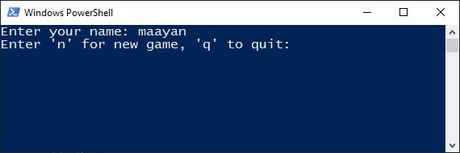
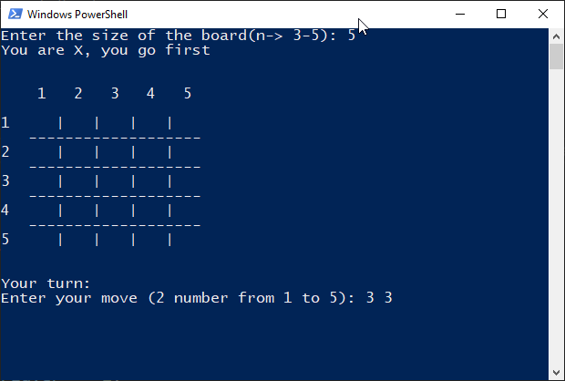

# TicTacToe_Minimax_nXn

## Introduction to TicTacToe NxN
The TicTacToe game is a two player game(In this case player VS computer) played on a NxN board. The goal of the game is to get N of your marks in a row (either vertically, horizontally or diagonally).

The board is divided into N rows and N columns. Each cell is either empty or contains one of the two players' marks - X or O.
Each turn, a player chooses a free cell and marks it with one of their marks.

## The Course of The Game
The game start by entering a client name and creating a file in which the game will be saved. If the client name is already used before, the game will be resumed from the saved game(if the same N is entered).

 

### Login

### Game

